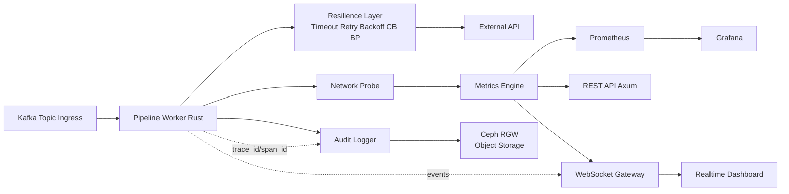
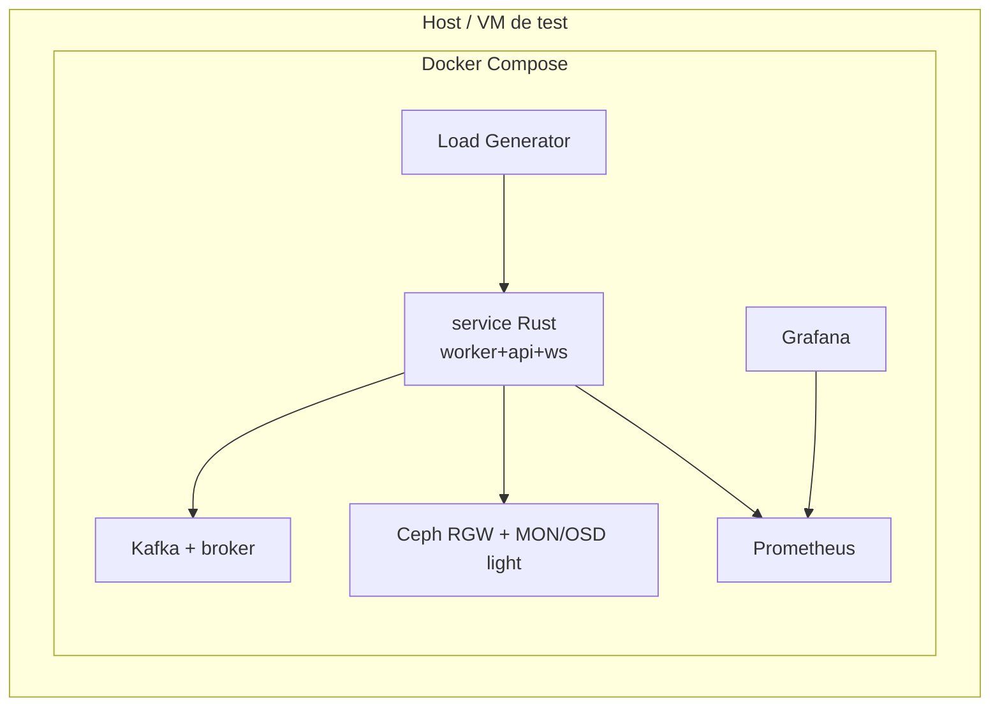
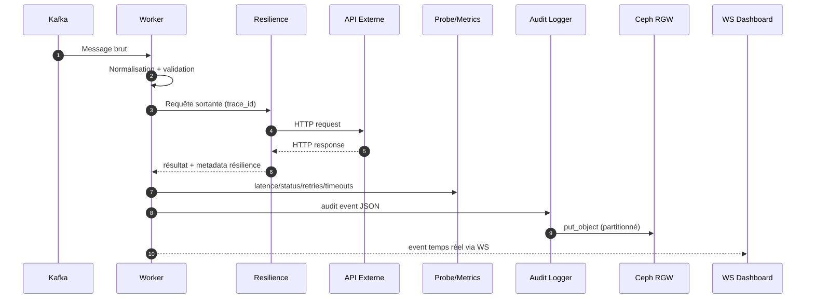
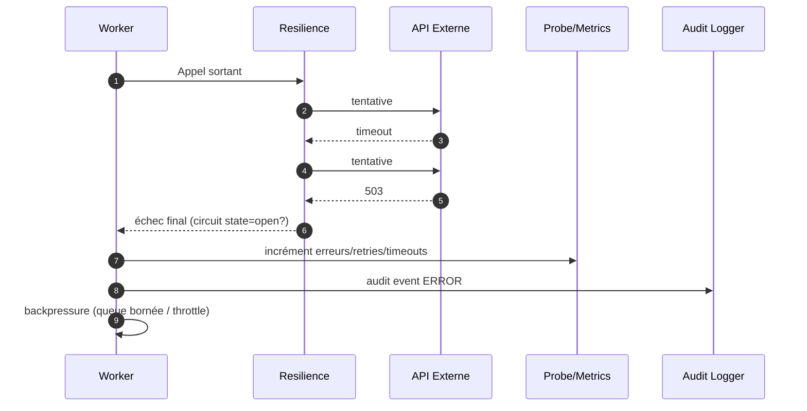

# 02 — Topologies et flux réseau

## 1) Topologie logique MVP

## 2) Topologie de déploiement (MVP Docker-first)

## 3) Flux nominal (ingestion → externe → audit)

## 4) Flux dégradé (erreur + backpressure)

## 5) Règles de topologie

- Le probe réseau est au plus près du client HTTP sortant.
- Les politiques de résilience sont centralisées, pas dispersées dans les handlers.
- L’audit est asynchrone avec garantie de livraison (buffer local borné + reprise).
- Le dashboard WS est alimenté par événements déjà corrélés (trace_id obligatoire).
