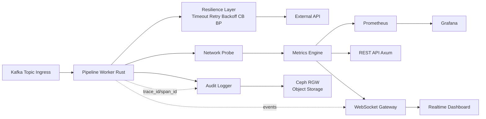
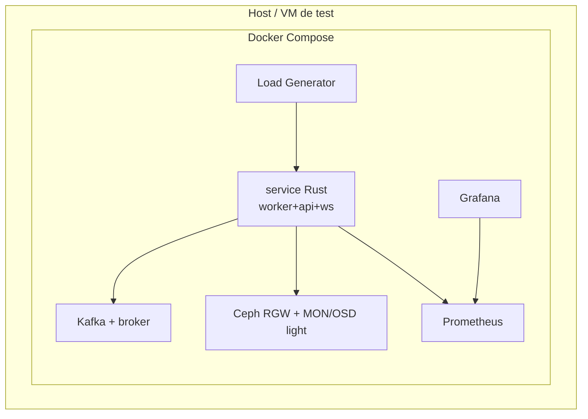
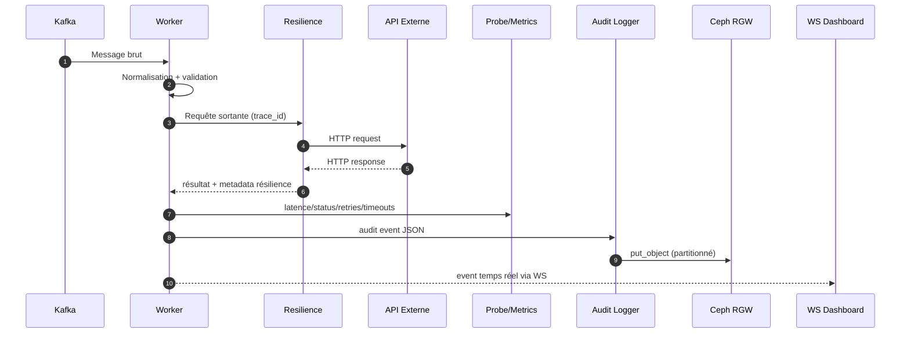
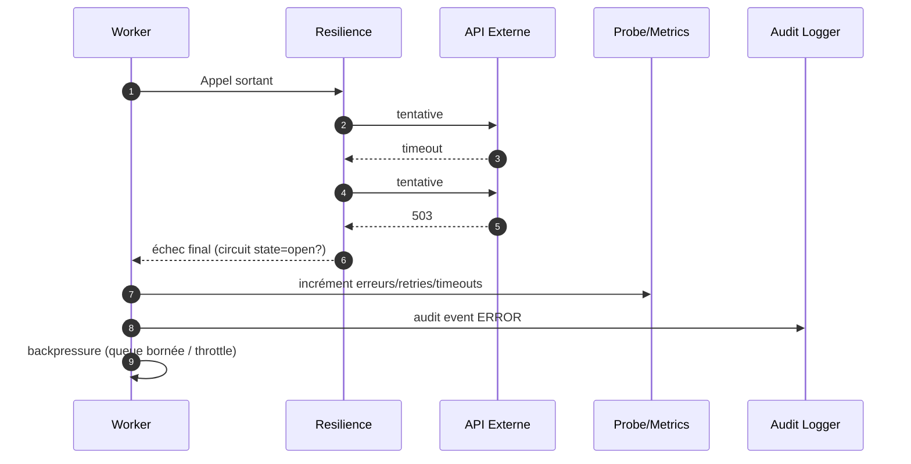
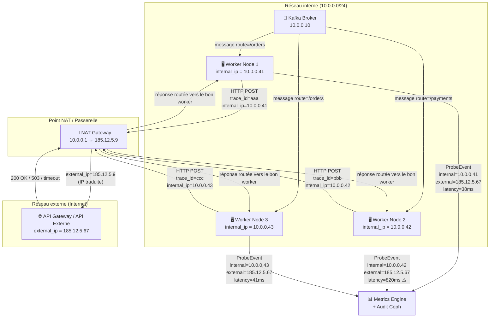
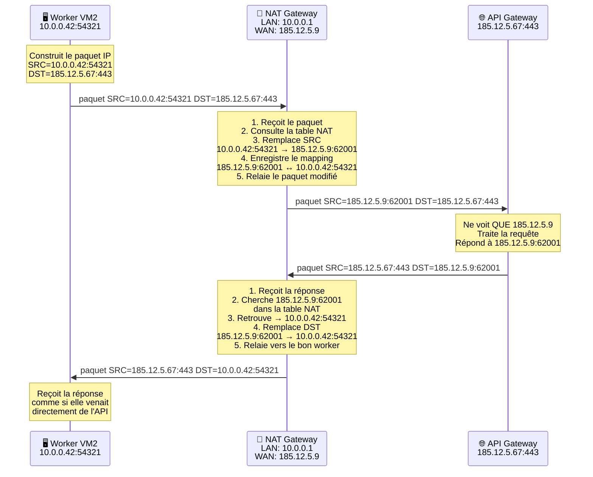

# 02 — Topologies et flux réseau

## 1) Topologie logique MVP

```mermaid
graph LR
    A[Kafka Topic Ingress] --> B[Pipeline Worker Rust]
    B --> C[Resilience Layer\nTimeout Retry Backoff CB BP]
    C --> D[External API]

    B --> E[Network Probe]
    E --> F[Metrics Engine]
    F --> G[Prometheus]
    G --> H[Grafana]

    B --> I[Audit Logger]
    I --> J[Ceph RGW\nObject Storage]

    F --> K[REST API Axum]
    F --> L[WebSocket Gateway]
    L --> M[Realtime Dashboard]

    B -.trace_id/span_id.-> I
    B -.events.-> L
```

## 2) Topologie de déploiement (MVP Docker-first)

```mermaid
graph TD
    subgraph HOST[Host / VM de test]
        subgraph DOCKER[Docker Compose]
            SVC[service Rust\nworker+api+ws]
            KAFKA[Kafka + broker]
            CEPH[Ceph RGW + MON/OSD light]
            PROM[Prometheus]
            GRAF[Grafana]
            LOAD[Load Generator]
        end
    end

    LOAD --> SVC
    SVC --> KAFKA
    SVC --> CEPH
    SVC --> PROM
    GRAF --> PROM
```

## 3) Flux nominal (ingestion → externe → audit)

```mermaid
sequenceDiagram
    autonumber
    participant K as Kafka
    participant W as Worker
    participant R as Resilience
    participant X as API Externe
    participant P as Probe/Metrics
    participant A as Audit Logger
    participant C as Ceph RGW
    participant D as WS Dashboard

    K->>W: Message brut
    W->>W: Normalisation + validation
    W->>R: Requête sortante (trace_id)
    R->>X: HTTP request
    X-->>R: HTTP response
    R-->>W: résultat + metadata résilience
    W->>P: latence/status/retries/timeouts
    W->>A: audit event JSON
    A->>C: put_object (partitionné)
    W-->>D: event temps réel via WS
```

## 4) Flux dégradé (erreur + backpressure)

```mermaid
sequenceDiagram
    autonumber
    participant W as Worker
    participant R as Resilience
    participant X as API Externe
    participant P as Probe/Metrics
    participant A as Audit Logger

    W->>R: Appel sortant
    R->>X: tentative #1
    X-->>R: timeout
    R->>X: tentative #2 (backoff)
    X-->>R: 503
    R-->>W: échec final (circuit state=open?)
    W->>P: incrément erreurs/retries/timeouts
    W->>A: audit event ERROR
    W->>W: backpressure (queue bornée / throttle)
```

## 5) Règles de topologie

- Le probe réseau est au plus près du client HTTP sortant.
- Les politiques de résilience sont centralisées, pas dispersées dans les handlers.
- L’audit est asynchrone avec garantie de livraison (buffer local borné + reprise).
- Le dashboard WS est alimenté par événements déjà corrélés (trace_id obligatoire).
## 6) Isolation interne/externe — simulation NAT multi-VM

Invariant I5 : chaque `ProbeEvent` et `AuditEvent` conserve les deux dimensions `internal_ip`
(source worker) et `external_ip` (destination API Gateway ou API finale). Sans ces deux champs,
une latence anormale est invisible par nœud source — l'agrégation efface l'information.

`external_ip` désigne le **premier point de sortie joignable** : IP directe de l'API, API Gateway
(Kong, AWS APIGW…) ou load balancer frontal. Ce qui se passe derrière est opaque pour NetScope.

```mermaid
graph TD
    subgraph INTERNAL["Réseau interne (10.0.0.0/24)"]
        VM1["🖥️ Worker Node 1\ninternal_ip = 10.0.0.41"]
        VM2["🖥️ Worker Node 2\ninternal_ip = 10.0.0.42"]
        VM3["🖥️ Worker Node 3\ninternal_ip = 10.0.0.43"]
        KAFKA["📨 Kafka Broker\n10.0.0.10"]
    end

    subgraph NAT["Point NAT / Passerelle"]
        GW["🔀 NAT Gateway\n10.0.0.1 ↔ 185.12.5.9"]
    end

    subgraph EXTERNAL["Réseau externe (Internet)"]
        API["🌐 API Gateway / API Externe\nexternal_ip = 185.12.5.67"]
    end

    KAFKA -->|"message route=/orders"| VM1
    KAFKA -->|"message route=/payments"| VM2
    KAFKA -->|"message route=/orders"| VM3

    VM1 -->|"HTTP POST\ntrace_id=aaa\ninternal_ip=10.0.0.41"| GW
    VM2 -->|"HTTP POST\ntrace_id=bbb\ninternal_ip=10.0.0.42"| GW
    VM3 -->|"HTTP POST\ntrace_id=ccc\ninternal_ip=10.0.0.43"| GW

    GW -->|"external_ip=185.12.5.9\n(IP traduite)"| API

    API -->|"200 OK / 503 / timeout"| GW
    GW -->|"réponse routée vers le bon worker"| VM1
    GW -->|"réponse routée vers le bon worker"| VM2
    GW -->|"réponse routée vers le bon worker"| VM3

    VM1 -->|"ProbeEvent\ninternal=10.0.0.41\nexternal=185.12.5.67\nlatency=38ms"| PROBE["📊 Metrics Engine\n+ Audit Ceph"]
    VM2 -->|"ProbeEvent\ninternal=10.0.0.42\nexternal=185.12.5.67\nlatency=820ms ⚠️"| PROBE
    VM3 -->|"ProbeEvent\ninternal=10.0.0.43\nexternal=185.12.5.67\nlatency=41ms"| PROBE
```

**Lecture diagnostique** : `internal_ip` identifie le nœud source en anomalie (ici VM2 à 820 ms) ;
`external_ip` identifie la destination. Si plusieurs gateways existent (région EU vs US), la latence
par destination devient immédiatement visible dans les métriques.

## 7) Mécanique interne du NAT Gateway — traduction d'adresses

Le worker **connaît** l'API Gateway et lui parle à travers le NAT.
L'API Gateway **ne connaît que le NAT** (IP WAN `185.12.5.9`) — l'IP interne du worker est
invisible pour elle. Le NAT est le seul composant qui maintient la correspondance complète
dans sa table de traduction (PAT — Port Address Translation) : c'est le layer de sécurité
qui isole le réseau interne du monde externe.

C'est précisément pour ça que NetScope capture `internal_ip` **au niveau applicatif** dans
`map_probe_event()`, côté worker, avant que le paquet quitte la machine — sinon l'information
est définitivement perdue.

```mermaid
sequenceDiagram
    participant VM2 as 🖥️ Worker VM2<br/>10.0.0.42:54321
    participant NAT as 🔀 NAT Gateway<br/>LAN: 10.0.0.1<br/>WAN: 185.12.5.9
    participant API as 🌐 API Gateway<br/>185.12.5.67:443

    Note over VM2: Construit le paquet IP<br/>SRC=10.0.0.42:54321<br/>DST=185.12.5.67:443

    VM2->>NAT: paquet SRC=10.0.0.42:54321 DST=185.12.5.67:443

    Note over NAT: 1. Reçoit le paquet<br/>2. Consulte la table NAT<br/>3. Remplace SRC<br/>   10.0.0.42:54321 → 185.12.5.9:62001<br/>4. Enregistre le mapping<br/>   185.12.5.9:62001 ↔ 10.0.0.42:54321<br/>5. Relaie le paquet modifié

    NAT->>API: paquet SRC=185.12.5.9:62001 DST=185.12.5.67:443

    Note over API: Ne voit QUE 185.12.5.9<br/>Traite la requête<br/>Répond à 185.12.5.9:62001

    API->>NAT: paquet SRC=185.12.5.67:443 DST=185.12.5.9:62001

    Note over NAT: 1. Reçoit la réponse<br/>2. Cherche 185.12.5.9:62001<br/>   dans la table NAT<br/>3. Retrouve → 10.0.0.42:54321<br/>4. Remplace DST<br/>   185.12.5.9:62001 → 10.0.0.42:54321<br/>5. Relaie vers le bon worker

    NAT->>VM2: paquet SRC=185.12.5.67:443 DST=10.0.0.42:54321

    Note over VM2: Reçoit la réponse<br/>comme si elle venait<br/>directement de l'API
```

**Table PAT maintenue par le NAT** (les 3 workers partagent une seule IP publique, différenciés par port) :

| IP interne | Port interne | IP WAN | Port WAN | Destination |
|---|---|---|---|---|
| 10.0.0.41 | 54320 | 185.12.5.9 | 62000 | 185.12.5.67:443 |
| 10.0.0.42 | 54321 | 185.12.5.9 | 62001 | 185.12.5.67:443 |
| 10.0.0.43 | 54322 | 185.12.5.9 | 62002 | 185.12.5.67:443 |