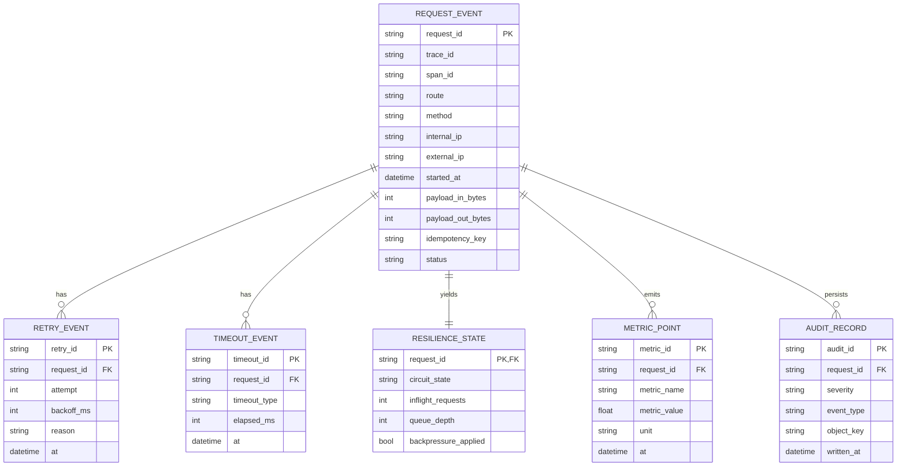

# 03 — Modélisation des données et schémas

## 1) Modèle relationnel logique (audit + métriques)

> Modèle relationnel de référence pour la compréhension métier.
> En MVP, le stockage principal d’audit est objet (Ceph) au format JSONL.



## 2) Schéma JSON d’un événement d’audit (MVP)

```json
{
  "event_version": "1.0",
  "event_type": "request.completed",
  "severity": "INFO",
  "timestamp": "2026-02-19T20:00:00Z",
  "trace_id": "2b6f...",
  "span_id": "8a1c...",
  "request_id": "req-...",
  "idempotency_key": "idem-...",
  "route": "/v1/partner/send",
  "method": "POST",
  "internal_ip": "10.0.0.12",
  "external_ip": "203.0.113.20",
  "upstream": {
    "host": "partner.example.net",
    "status_code": 200,
    "latency_ms": 142
  },
  "resilience": {
    "retry_count": 1,
    "timeout_count": 0,
    "circuit_state": "closed",
    "backpressure": false
  },
  "network": {
    "bytes_sent": 812,
    "bytes_received": 1210
  },
  "result": {
    "outcome": "success",
    "error_code": null,
    "error_message": null
  }
}
```

## 3) Convention de clé objet Ceph (RGW)

Format recommandé:

`netscope-audit/{yyyy}/{mm}/{dd}/{service}/{route_hash}/{hour}/events-{node}-{seq}.jsonl`

Bénéfices:
- partition temporelle simple
- distribution de charge RGW
- relecture ciblée par service/route

## 4) Modèle d’agrégation métrique

- **Compteurs**: `requests_total`, `errors_total`, `timeouts_total`, `retries_total`
- **Jauges**: `pool_saturation`, `queue_depth`, `inflight_requests`, `circuit_state`
- **Histogrammes**: `request_latency_ms` (bucket stable)
- **Débit**: dérivé `requests_total / fenêtre`

## 5) Exigences de qualité des données

- Champs obligatoires: `trace_id`, `request_id`, `timestamp`, `route`, `outcome`
- Horodatage UTC ISO-8601
- Schéma versionné (`event_version`) pour compatibilité ascendante
- Rejet explicite des événements invalides vers une file de quarantaine
