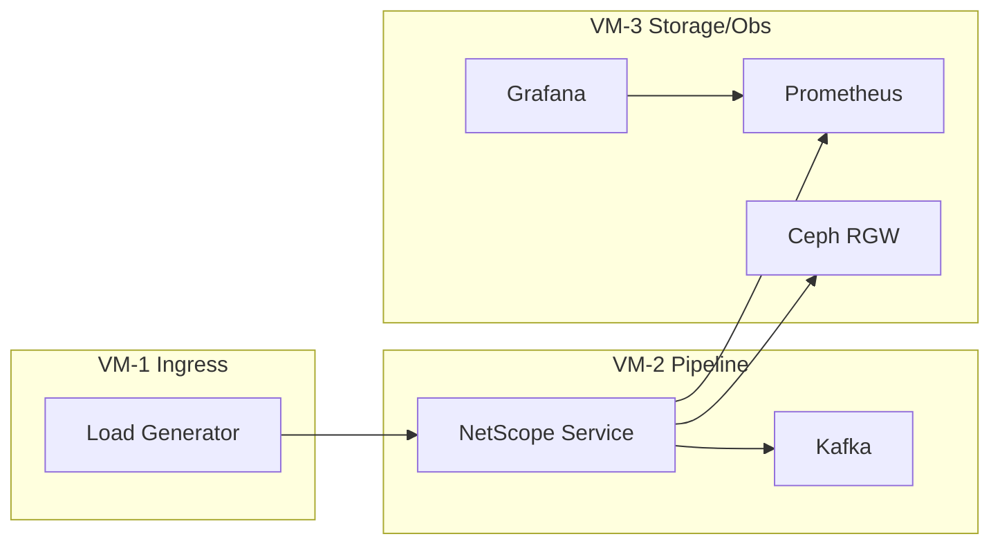

# 04 — Plan de validation, volumétrie et gouvernance

## 1) Stratégie de validation (progressive)

### Niveau A — Tests de base
- Validation des invariants (idempotence, timeout, corrélation).
- Tests unitaires sur politiques de résilience.
- Tests d’intégration Kafka → API externe mockée → audit Ceph.

### Niveau B — Tests réseau dégradés
- Injection de latence et pertes (VM/TC/netem).
- Vérification de la stabilité p95/p99 et du comportement circuit breaker.
- Contrôle du backpressure (absence d’explosion mémoire/threads).

### Niveau C — Volumétrie importante
- Génération charge continue (k6/Locust) avec paliers.
- Mesure saturation CPU, mémoire, IO Ceph RGW, queue depth.
- Validation des SLO en charge nominale et pic.

## 2) Topologie volumétrie (VirtualBox possible)

## 3) Critères d’acceptation MVP

- 100% des requêtes sortantes traçables (`trace_id` présent).
- 100% des événements critiques écrits dans Ceph (ou buffer de reprise durable).
- Dashboard WS reflète les événements en < 2 s.
- p95 latence conforme cible en charge nominale définie.
- Aucun retry non idempotent autorisé.

## 4) Documentation d’exploitation (Runbook minimal)

- Procédure de démarrage/arrêt environnement Docker.
- Checklist de santé: Kafka, service, RGW, métriques, WS.
- Procédure incident: hausse erreurs, circuit ouvert, retard audit, saturation queue.
- Procédure replay depuis Kafka / reconstitution depuis audit Ceph.

## 5) Gouvernance technique

- Revues d’architecture brèves à chaque étape (Probe, Metrics, API, WS, Ceph).
- Contrat de schéma d’événement gelé par version.
- Changement d’invariant = décision explicite + mise à jour doc obligatoire.
