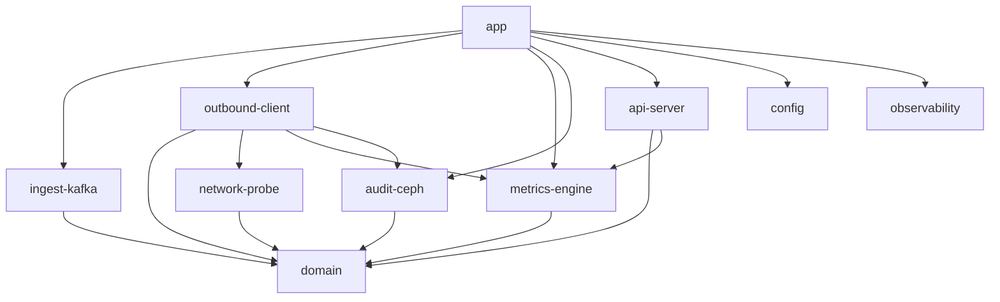

# 07 — Architecture de référence du workspace Rust

## 1) Objectif

Définir une structure de code Rust idiomatique et testable pour implémenter NetScope en MVP, avec séparation stricte des responsabilités:
- ingestion et orchestration pipeline,
- mesure réseau,
- résilience,
- exposition API/WS,
- audit Ceph.

## 2) Organisation workspace (proposée)

```text
netscope/
  Cargo.toml                    # workspace
  crates/
    app/                        # binaire principal (composition)
    ingest-kafka/               # consumer + normalisation
    outbound-client/            # client HTTP externe + policies résilience
    network-probe/              # interception/mesure réseau
    metrics-engine/             # agrégation + export Prometheus
    audit-ceph/                 # writer RGW (S3-compatible)
    api-server/                 # Axum REST + WebSocket
    domain/                     # types métier + invariants + contrats
    config/                     # chargement/validation configuration
    observability/              # tracing/logging bootstrap
    test-support/               # mocks, fixtures, generators
```

## 3) Dépendances entre crates



## 4) Contrats de modules (niveau domaine)

## 4.1 Types centraux
- `RequestContext`: `trace_id`, `span_id`, `request_id`, `idempotency_key`, `route`, `internal_ip`, `external_ip`.
- `OutboundResult`: status, latence, tailles payload, métadonnées retries/timeouts.
- `AuditEvent`: événement immuable versionné (`event_version`).
- `ResilienceSnapshot`: état circuit, queue depth, inflight, saturation.

## 4.2 Traits (ports)
- `OutboundGateway`: exécution d’appel externe avec policies résilience.
- `AuditSink`: persistance des événements (impl Ceph RGW).
- `MetricsRecorder`: compteurs/jauges/histogrammes.
- `EventBus`: diffusion interne vers WS/consommateurs techniques.

## 4.3 Règles
- Les handlers HTTP n’implémentent pas de logique métier.
- Les policies résilience vivent dans `outbound-client`.
- Les schémas d’événements sont définis dans `domain` uniquement.

## 5) API Server (Axum) — découpage interne

```text
api-server/
  src/
    main.rs
    app_state.rs
    routes/
      health.rs
      metrics.rs
      resilience.rs
      websocket.rs
    extractors/
      trace_context.rs
      client_ip.rs
    middleware/
      request_id.rs
      timeout.rs
      rate_limit.rs
      tracing.rs
    dto/
      metrics_response.rs
      resilience_response.rs
    services/
      metrics_service.rs
      resilience_service.rs
      ws_hub.rs
```

## 6) Gestion du state global

- `AppState` unique, clonable (Arc), injecté par Axum.
- Contient uniquement:
  - handles sur services applicatifs,
  - config immutable validée,
  - clients techniques thread-safe.
- Interdiction des singletons implicites globaux.

## 7) Testabilité par niveau

- **Unit tests**: politiques retry/backoff/circuit breaker, normalisation, validation schéma.
- **Integration tests**: API routes, pipeline Kafka mocké, audit sink mocké.
- **Contract tests**: format `AuditEvent` versionné, compatibilité ascendante.
- **Load tests**: scénarios débit/latence/timeouts et impact sur p95/p99.

## 8) Conventions techniques minimales

- `thiserror` pour erreurs domaine/infra et mapping explicite.
- `tracing` + logs JSON corrélés (`trace_id`, `request_id`).
- `serde` pour DTO/API/audit (schémas stables).
- `tower` pour middlewares transverses.
- `tokio::sync::mpsc` borné pour backpressure explicite.

## 9) Stratégie de configuration

- Priorité: variables d’environnement + fichier `.env` local.
- Validation au boot (fail-fast):
  - endpoints Kafka/RGW,
  - credentials,
  - seuils résilience,
  - buckets histogrammes.
- Les valeurs critiques sont centralisées dans `config`.

## 10) Jalons d’implémentation alignés backlog

- S1: squelette `domain`, `outbound-client`, `network-probe`.
- S2: `metrics-engine` + exposition scrape.
- S3: `api-server` routes santé/métriques/résilience.
- S4: `websocket` hub + diffusion événements.
- S5: `audit-ceph` + buffer/reprise.
- S6: `test-support` + campagnes de charge et rapport.

## 11) Anti-patterns à éviter

- Mélanger logique métier et transport HTTP.
- Multiplication de formats d’événements non versionnés.
- Labels métriques non contrôlés (cardinalité explosive).
- Écriture Ceph synchrone sur chemin critique.
- Retry aveugle sans idempotence.
